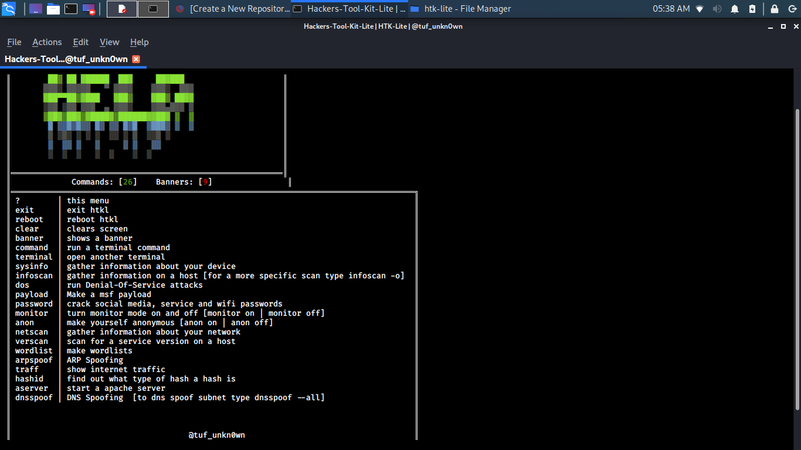
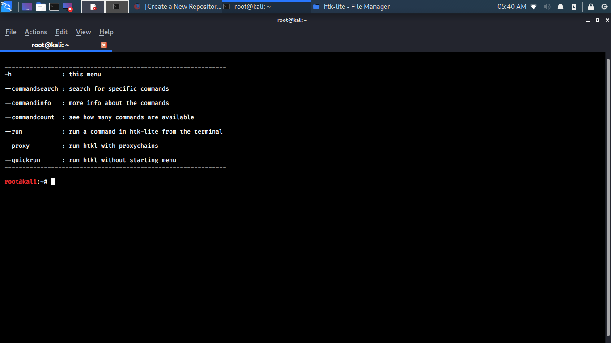

# htk-lite
htk-lite is a lighter version of hackers-tool-kit but it still has the same hacking ability as hackers-tool-kit too see updates check my instagram @tuf_unkn0wn

# install

INSTALLING IN /root/ DIRECTORY IS NOT REQUIRED BUT IS RECOMMENDED

* `git clone https://github.com/unkn0wnh4ckr/htk-lite`

* `cd htk-lite`

* `python install.py`

# run

RUNNING AS ROOT IS NOT REQUIRED BUT IS RECOMMENDED

 * `cd htk-lite`
 
 * `python htkl.py` or `python htkl.py -h`
 
 # update
 
 * `cd htk-lite`
 
 * `python htklupdate.py`

